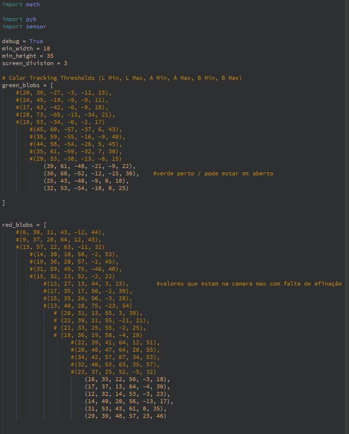
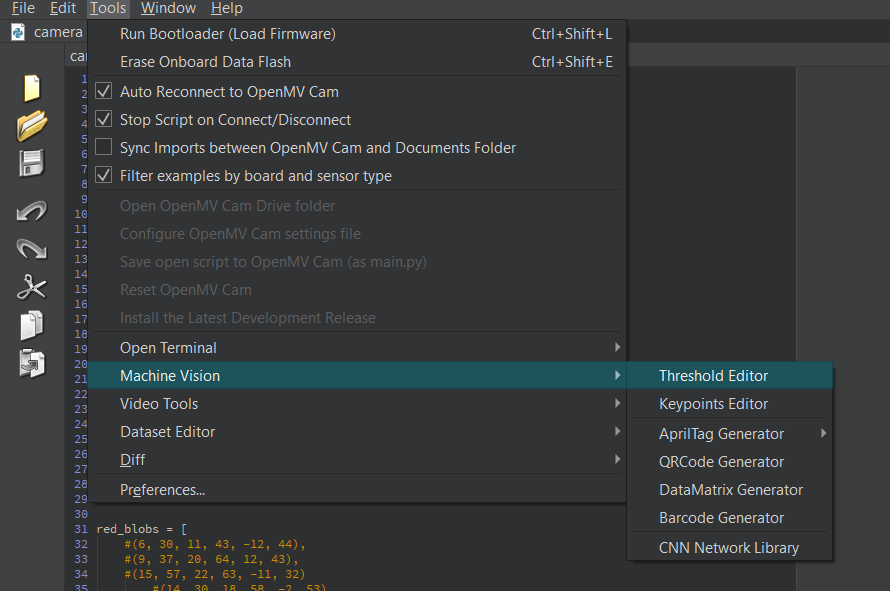
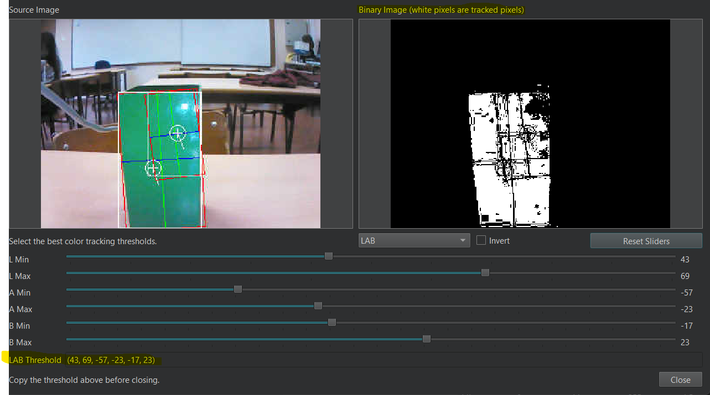
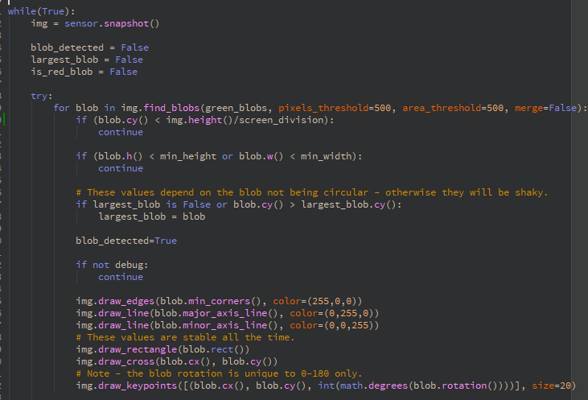
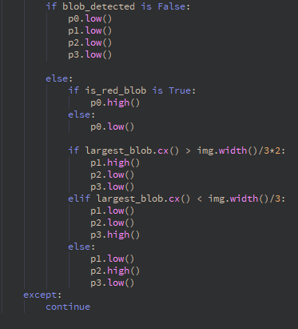

Engineering materials
====

This repository contains engineering materials of a self-driven vehicle from the team AGSG from Portugal in the WRO Future Engineers competition in the season 2024.

## Content

* `t-photos` contains 2 photos of the team (an official one and one funny photo with all team members)
* `v-photos` contains 6 photos of the vehicle (from every side, from top and bottom)
* `video` contains the video.md file with the link to a video where driving demonstration exists
* `schemes` contains one or several schematic diagrams in form of JPEG, PNG or PDF of the electromechanical components illustrating all the elements (electronic components and motors) used in the vehicle and how they connect to each other.
* `src` contains code of control software for all components which were programmed to participate in the competition
* `models` is for the files for models used by 3D printers, laser cutting machines and CNC machines to produce the vehicle elements. If there is nothing to add to this location, the directory can be removed.
* `other` is for other files which can be used to understand how to prepare the vehicle for the competition. It may include documentation how to connect to a SBC/SBM and upload files there, datasets, hardware specifications, communication protocols descriptions etc. If there is nothing to add to this location, the directory can be removed.

## Introduction

_This part must be filled by participants with the technical clarifications about the code: which modules the code consists of, how they are related to the electromechanical components of the vehicle, and what is the process to build/compile/upload the code to the vehicle’s controllers._

### The Code

    Our Code is divided into 4 main stages:

        1. It starts by moving forward, while dodging the obstacles, until it reaches the first line, there it will recognize if the round is clockwise or counter-clockwise..
        2. Then it knows which way to turn, so it will count the lines of the same color and do the first two laps in that direction..
        3. After 8 lines of the same color, it will invert the orientation of the lap if the last obstacle was color is red or continue as it was in the last lap if it was green.
        4. Then to finish the round it will go seek the parking lot by following the outerwall until it finds the right spot.
    

#### The Code: Setup and Compilation

    To program, complile and upload the code to the robot we use the picaxe IDE, which is based in basic.
    When the IDE is run, it asks for the picaxe version, and the cable port.
    In our robot we use 4 processors, the main processor is a picaxe 28x2, that handles and runs the main code, two processors are slaves, one picaxe 14M2, for the rgb sensor and line counting and the other slave is a picaxe 28x2 for handling the motors. The last processor is integrated in the camera from OpenMV and is programmed in python.

    The processors communicate with each other through bits.

    The picaxe IDE can be found at https://www.picaxe.com/ 
    It is also needed to install de drivers so it can recognize the cable used for programming, they can also be found at the picaxe website.

#### The Code: Explained 

#### The Code: Camera

    For the camera we use an OpenMV H7 camera and to program it and calibrate it we use the OpenMV IDE.
    All the libraries required are present in the OpenMV IDE.

    In the beggining of the code we initialize the libraries used for the camera
    The variable screen_disivion is used to divide the screen in X sections, For example X=3, the screen will be divided and only the bottom 2/3 of the screen will be used to track the obstacles.
    Then we initialized the variables green_blobs and red_blobs. The blobs refer to the color detected by the camera and their positionin the screen.
    Each bracket represents the color code seen by the camera, there is a few parameters because of the diferent angles that the camera can see the obstacles.

    

    These treshholds can be obtained from the menu tools/machine vision/Threshhold Editor.

    

    Then we adjust the sliders to track just the object that we want to track.

    

    After getting the color values, we use the blobs position in the screen to send bits to the main processor indicating if the blobs detected are green or red and if they are on the right, left or in the middle.

    

    Sending the bits to the main processor.
    

   
